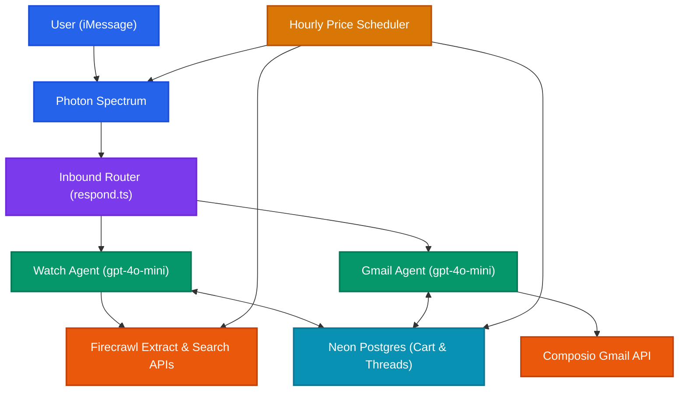
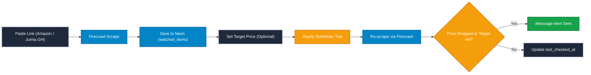

# Okupy

Okupy is an iMessage-first shopping and price-tracking concierge built on Node.js and the Vercel AI SDK over Photon Spectrum.

1. **Price Drop & Target Alerts**: Monitors Amazon and Jumia Ghana (`jumia.com.gh`) products. Users paste product links or search by name. An hourly background scheduler scrapes watched items every 24h via Firecrawl `/extract` and texts the user on iMessage the moment a price drops or reaches a user-defined target.
2. **Gmail Deal Scanner**: Integrates with Gmail via Composio. When requested ("check my Gmail for deals"), scans promotional emails from Amazon and Jumia, surfaces structured offers with product links, and tracks chosen items on command.

Both agents use the **Vercel AI SDK** (`generateText` + tools) backed by `gpt-4o-mini` via AIML API. Multi-turn conversation threads and watch carts persist in Neon Postgres. Photon Spectrum handles iMessage messaging.

---

## Architecture



---

## How It Works

### 1. Price Tracking & Drop Alerts



- **Stores Supported**: Amazon and Jumia Ghana (`jumia.com.gh`). Non-Ghana Jumia domains are cleanly rejected with a request for the `.com.gh` link.
- **Search by Name**: Users can ask "Find an iPhone 15 on Jumia" or "Search Amazon for wireless keyboard" to view numbered product results and choose which item to track.
- **Automated Monitoring**: Items are checked at most once every 24 hours (staggered across hourly ticks) to avoid aggressive scraping.
- **Alert Triggers**: Notifications fire when the price drops below the previous recorded price or drops under a target price set by the user.

### 2. User-Triggered Gmail Deal Scanner

```mermaid
flowchart LR
    classDef user fill:#2563eb,stroke:#1d4ed8,stroke-width:2px,color:#ffffff;
    classDef composio fill:#9333ea,stroke:#7e22ce,stroke-width:2px,color:#ffffff;
    classDef agent fill:#0d9488,stroke:#0f766e,stroke-width:2px,color:#ffffff;
    classDef cart fill:#ea580c,stroke:#c2410c,stroke-width:2px,color:#ffffff;

    U["User: 'Check my Gmail for deals'"]:::user --> S["Composio Gmail Scan"]:::composio
    S --> P["Filter Amazon & Jumia Promos"]:::composio
    P --> R["Gmail Agent Lists Deals"]:::agent
    R --> T["User: 'Track 1 and 2'"]:::user
    T --> A["Add Links to Watch Cart"]:::cart
    A --> C["Confirmation via iMessage"]:::user
```



- **Identity Scoped**: The iMessage sender handle is tied to the Composio session, ensuring zero cross-user access.
- **Natural Interaction**: The agent summarizes promotional emails from the last 14 days, outputs clean numbered options, and adds chosen products directly to the user's watch cart.

---

## Local Setup

```bash
npm install
cp .env.example .env
# Fill in AIML_API_KEY, FIRECRAWL_API_KEY, COMPOSIO_API_KEY, and DATABASE_URL
npm run dev
```

To run database tests against a throwaway Neon branch:

```bash
export DATABASE_URL_TEST=postgresql://...branch-host...?sslmode=require
npm test
```

Useful commands:

```bash
npm test
npm run typecheck
npm run build
```

---

## Deployment

Deployable directly on Render via `render.yaml`:
- Set `DATABASE_URL` to a pooled Neon Postgres connection string.
- Provide `AIML_API_KEY`, `FIRECRAWL_API_KEY`, `COMPOSIO_API_KEY`, and Spectrum credentials.
- Automatic migrations run on startup (`runMigrations()`).
