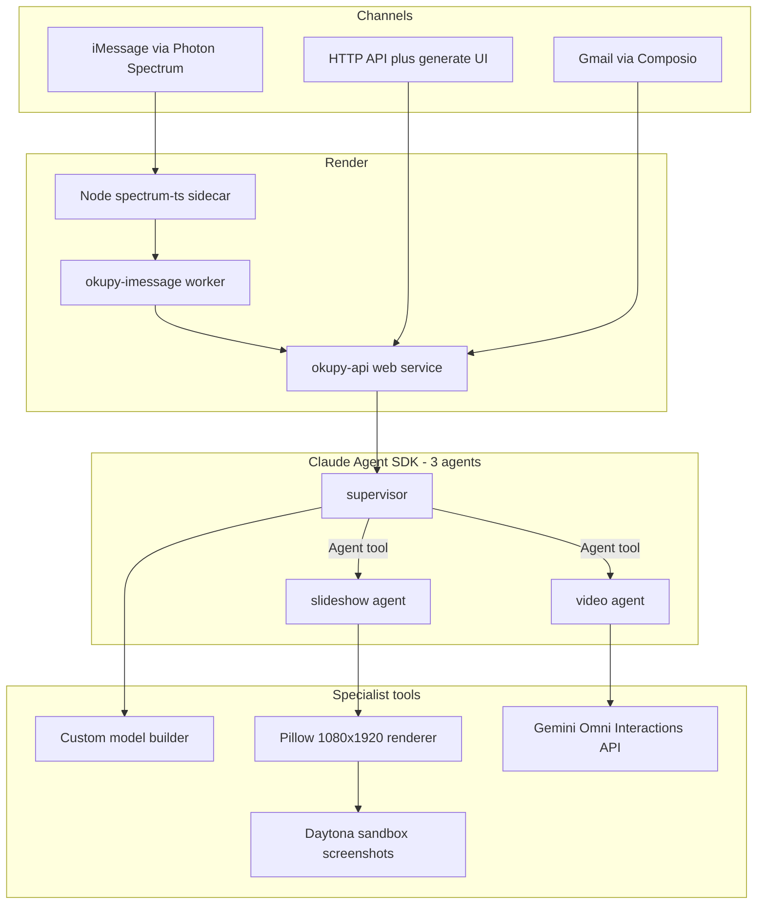
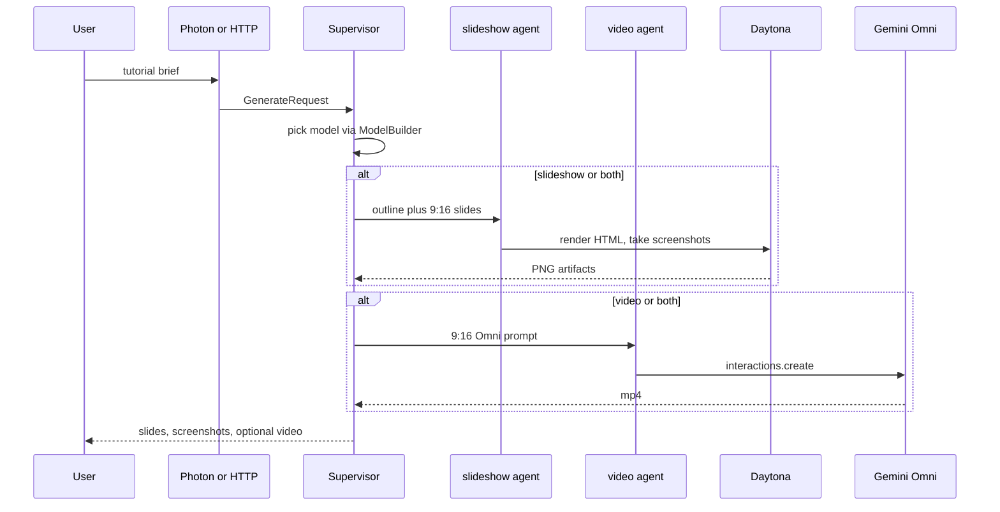

# Okupy architecture

## What we are building

Okupy is a tutorial engine. You give it a tutorial. It produces:

1. A **TikTok slideshow** (9:16 image carousel, not a PowerPoint deck)
2. Optional **AI video** through **Google Gemini Omni**
3. **Screenshots** of the finished slides from a **Daytona** sandbox
4. Delivery over **iMessage** (Photon Spectrum) and **Gmail** (Composio)

The Claude Agent SDK runs a **3-agent orchestration**: one supervisor and two specialists.





## Pushback on the original decisions

The brief asked for the diagram first, then honest pushback. These are the calls I would not copy blindly.

### 1. Three agents, but not three processes

Keep the **supervisor + two specialists** split. Do **not** run three separate Claude Agent SDK processes (or three Render services).

The SDK already does this: one `query()` session is the supervisor, and `ClaudeAgentOptions.agents` registers `slideshow` and `video` as `AgentDefinition`s. The supervisor calls the `Agent` tool. That is still three agents. Three processes would triple Anthropic spend, split memory, and make Daytona/Photon handoff worse.

Each specialist owns one job:

| Agent | Owns |
| --- | --- |
| `supervisor` | Routing, model profile, Composio, Photon replies |
| `slideshow` | Tutorial outline, TikTok carousel, Daytona screenshots |
| `video` | Gemini Omni prompts and clip generation |

### 2. Do not default to Opus

"Use a custom model builder instead of Claude or Opus" is the right instinct. The builder stores **named profiles**: model id, Anthropic API key, optional `ANTHROPIC_BASE_URL`. Per-request overrides swap the key or the model without a code change. Default is `OKUPY_MODEL` (Sonnet-class), not Opus. Opus remains an optional profile.

### 3. Photon is TypeScript. Python cannot speak Spectrum directly.

[Photon Spectrum](https://photon.codes) is the right iMessage path (managed line, no Mac relay). The official SDK (`spectrum-ts`) is **TypeScript and gRPC**. There is no public HTTP message API. A Node sidecar is required. On Render that sidecar belongs on a **worker**, not the web service. Free/starter web instances sleep; a sleeping process drops the gRPC stream and iMessage goes dark.

### 4. Daytona is a camera, not the agent runtime

Daytona is a good sandbox for **computer-use screenshots**. It is a bad place to run the whole Claude loop (cost, latency, secrets). The slideshow agent writes 1080×1920 PNGs with Pillow locally so CI and local demo work without Daytona. When `DAYTONA_API_KEY` is set, the same HTML deck is opened in a Daytona desktop and screenshotted as a visual check.

### 5. TikTok slideshows are image carousels

"Slide shoes / slideships" in the dictation means **TikTok slideshows**: 1080×1920 PNGs, short copy, 5–8 cards. Not PPTX, not 16:9 YouTube slides. Video is a separate Omni output at `9:16`.

### 6. Composio, not homemade Gmail OAuth

Composio is the auth layer for Gmail and later apps. Users hit `/v1/auth/gmail`, get a Connect Link, authenticate, and the supervisor can draft or send through Composio tools. Do not reinvent Google OAuth in this repo.

### 7. Render is two services

`render.yaml` defines:

- `okupy-api` — FastAPI + generate UI
- `okupy-imessage` — Photon sidecar + inbound worker

Secrets stay `sync: false`.

## Custom model builder

```
POST /v1/models
{
  "name": "work-anthropic",
  "model_id": "claude-sonnet-4-5",
  "api_key": "sk-ant-...",
  "base_url": null
}
```

Resolved profiles become `ClaudeAgentOptions(model=..., env={ANTHROPIC_API_KEY, ANTHROPIC_BASE_URL, ANTHROPIC_MODEL})`. Specialists inherit unless a profile sets a per-agent model.

## Direct vs agent mode

`OKUPY_AGENT_MODE=direct` (default for tests) runs the same three-agent plan without calling Anthropic. `OKUPY_AGENT_MODE=agent` uses the Claude Agent SDK when a key is present. The tools underneath are identical, so slideshows still generate in CI.
