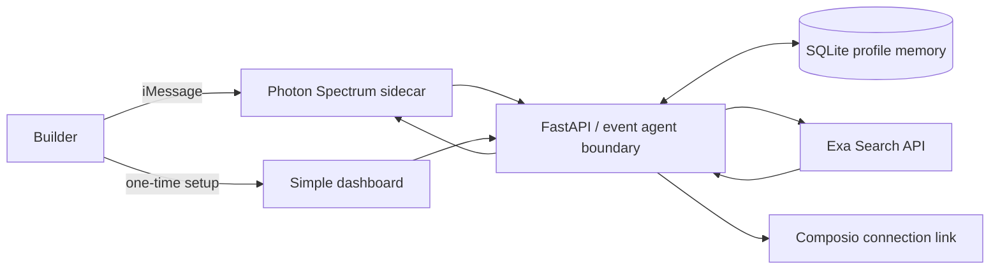

# Okupy architecture

The product is deliberately one agent, not a slideshow pipeline. `BuilderEventAgent` has a narrow job: use remembered context to find credible reasons for a builder to meet people in person. HTTP and iMessage call the same agent method, so behavior cannot drift by channel.

## Ranking and safety

Exa performs live discovery. Okupy requests dated local founder, developer, hackathon, and community pages, then tags explicit text signals for free food, networking, and credits. Results always retain their source URL. The reply asks users to verify RSVP and perks because event details change. Production ranking should additionally parse event dates and deduplicate venues before proactive alerts.

## Memory

Profiles store project, stage, goals, interests, location, radius, and update time in SQLite on Render's persistent disk. Do not put OAuth credentials or message bodies in this profile. A production rollout should authenticate dashboard access, normalize phone IDs, encrypt the disk, support deletion/export, and apply retention limits.

## Integrations

- **Agent boundary:** the agent and tools are isolated in `agent.py`. The deterministic local path makes development and tests safe without sending user data to a model.
- **Exa:** server-side search only; the browser never receives its key.
- **Photon Spectrum:** a Node sidecar owns the persistent iMessage SDK connection and forwards inbound messages to the API.
- **Composio:** creates a scoped Gmail Connect Link; Okupy never collects a Google password. Gmail is connection-only in this release.
- **Render:** one web service with persistent memory and one private Photon service. Secrets are marked `sync: false`.
