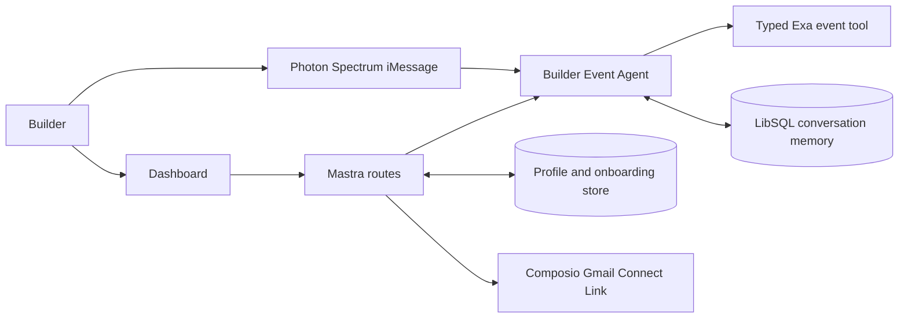

# Architecture

Okupy is one TypeScript process built and served by Mastra.

`BuilderEventAgent` is a Mastra `Agent`. Its Exa integration is a typed Mastra tool that performs time-bounded searches and classifies explicit food, networking, and builder-credit signals. Results retain source URLs, and replies remind users to verify event and RSVP details.

The dashboard and Photon Spectrum call the same response boundary. New iMessage senders complete a short persisted onboarding conversation before discovery, so restarts do not lose their progress. Mastra conversation history uses a LibSQL store on the Render disk and is partitioned by stable channel identity.

Photon runs inside the same Node process. There is no sidecar server, Python worker, FastAPI service, Uvicorn process, slideshow/video pipeline, Daytona integration, or internal API URL.

All public integration locations are source-controlled in `src/mastra/config.ts`. Only provider credentials and secrets are read from the environment. Production deployments should additionally authenticate dashboard profile access, normalize channel identities, encrypt persistent data, and provide profile deletion/export and retention controls.
