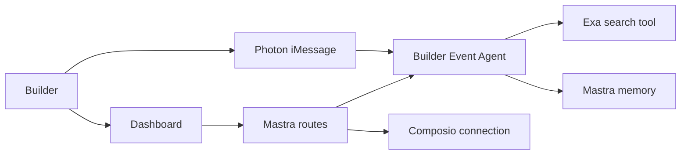

# Architecture

Okupy is one TypeScript process built and served by Mastra.

`BuilderEventAgent` is a Mastra `Agent`. Its Exa integration is a typed Mastra tool, and Mastra memory keeps conversation context by phone number. A small persistent profile document stores structured project, location, and goal fields on the Render disk.

Photon Spectrum runs inside the same Node process and calls the same response function as the HTTP discovery route. There is no sidecar server, Python worker, or invented internal API URL.

All public integration locations are source-controlled in `src/mastra/config.ts`. Only secrets and provider credentials are read from the environment.
