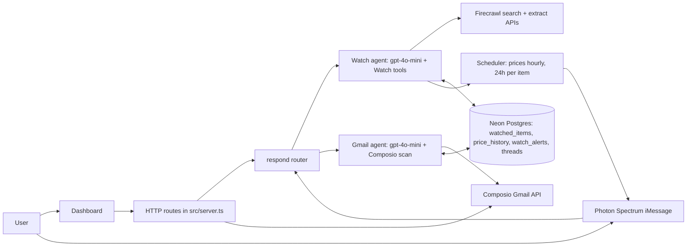

# Okupy Architecture

> Project name is **Okupy** (`okupy`, service `okupy-api`).

Okupy is a TypeScript Node service built on the Vercel AI SDK over Photon Spectrum. Two iMessage-first agents share one inbound router, one Neon Postgres database, and one Spectrum iMessage transport.

`runWatchAgent` and `runGmailAgent` use `generateText` with typed tools and `stepCountIs(6)`.

The watch agent tracks Jumia Ghana (`jumia.com.gh/...-<ID>.html`) plus Amazon.
Users can paste a product URL directly or search by product name. Name searches
return numbered, canonical product-page matches; the user selects one, or can
explicitly ask the agent to track the best match immediately. All cart tools
bind the authenticated Spectrum sender ID server-side rather than trusting an
ID generated by the model.
Jumia links from any other country (`.com.ng`, `.co.ke`, `.com.eg`, `.ma`, …)
are rejected with a message asking for the `jumia.com.gh` version. Each link is
scraped through Firecrawl `/extract`, baselined, then checked at most once
every 24h (hourly batch of 5, staggered by `last_checked_at`). Missing prices
only bump `last_checked_at`; they never overwrite `last_price` with a
placeholder. Dedupe is per `(user_id, store, asin)`, so the same numeric id on
Amazon and Jumia tracks independently. Jumia Ghana prices use GHS; Amazon items
default to USD unless the scrape returns a code.

The dashboard and Photon Spectrum call the same response boundary (`respond()`).
Conversation history lives in Neon `agent_threads` (30 messages per user,
namespaced `watch:` for the watch agent, `gmail:` for the Gmail agent) and is
partitioned by stable channel identity.

Photon runs inside the same Node process. There is no sidecar server, Python
worker, FastAPI service, Uvicorn process, slideshow/video pipeline, Daytona
integration, Mastra runtime, LibSQL file, or internal API URL.

All public integration locations are source-controlled in
`src/agent/config.ts`. Only provider credentials and secrets are read from the
environment (`AIML_API_KEY`, `FIRECRAWL_API_KEY`,
`COMPOSIO_API_KEY`, `DATABASE_URL`, `SPECTRUM_*`, optional `PUBLIC_BASE_URL`,
`WATCH_POLL_INTERVAL_MS`, `WATCH_BATCH_SIZE`). Gmail OAuth callbacks are built
from allowlisted `PUBLIC_BASE_URL` (https only), never from a client `?host=`.
Production deployments should additionally authenticate dashboard
access, normalize channel identities, encrypt persistent data, and provide
user data deletion/export and retention controls.
